## 実験データの処理

各種実験（`piControl`，`abrupt-2xCO2`，`abrupt-4xCO2`，`1pctCO2`，`historical`，`ssp119`，`ssp245`，`ssp370`，`ssp460`，`ssp585`）のそれぞれについて，
必要な変数（`tas`，`rsdt`，`rsut`，`rlut`，`areacella`）のデータ（例えばMIROC6であれば，`data_raw/CMIP6/required.txt`に挙げたもの）を[ESGF](https://esgf.llnl.gov/)からダウンロードておく．
これを全て`data_raw/CMIP6`に置く．
面積データ（`areacella*.nc`）は必ずしも必要でない．

全球年平均の時系列データ（csvファイル）の作成：
```
python process_cmip_data.py [--model_id MIROC6]
```
引数の`model_id`はダウンロードしたデータに応じて適宜変更（デフォルトは`MIROC6`）．

## 実験データのプロット

コントロール実験，倍増実験，漸増実験：
```
python plot_experiment_tas.py [--model_id MIROC6]
```
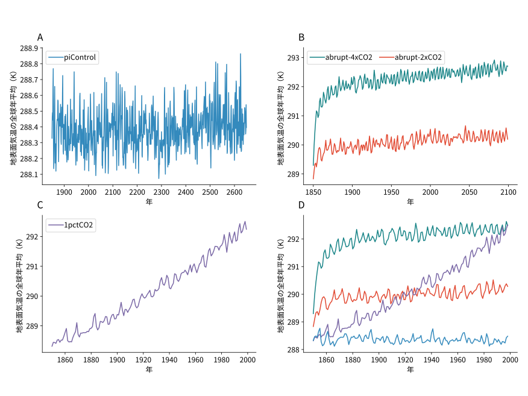

歴史実験：

```
python plot_historical_tas.py [--model_id MIROC6]
```
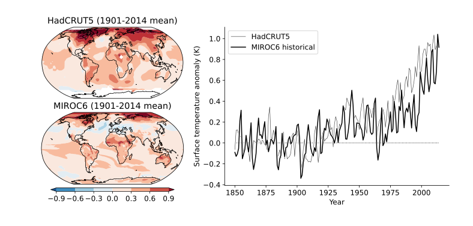

シナリオ実験：
```
python plot_scenario_tas.py [--model_id MIROC6]
```


## 気候エミュレータ

2層のボックスモデルのカリブレーション（`abrupt-4xCO2`に基づく）：
```
Rscript calibrate_emulator.r [MIROC6]
```
推定結果は`output`フォルダに保存される．

カリブレイトされたエミュレータの内的妥当性（`abrupt-4xCO2`）と
外的妥当性（`historical`，`ssp119`，`ssp245`，`ssp370`，`ssp460`，`ssp585`）を評価：
```
python evaluate_emulator.py [--model_id MIROC6]
```
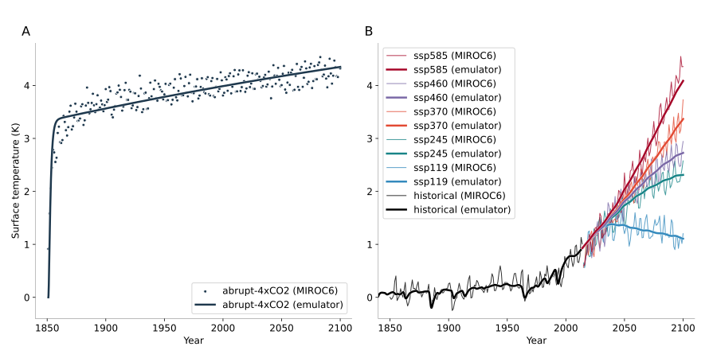

## 物質循環

Joos et al. (2013)の実験結果（`PI100`，`PD100`，`PI5000`）を用いて線形炭素循環モデルのカリブレーション：
```
python calibrate_co2_cycle_linear.py
```
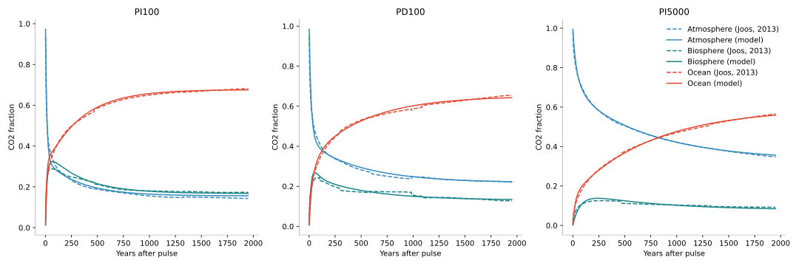

線形モデルのパラメタをベースラインとして，
フィードバック効果を考慮した非線形モデルに拡張する．
```
python calibrate_co2_cycle_nonlinear.py
```
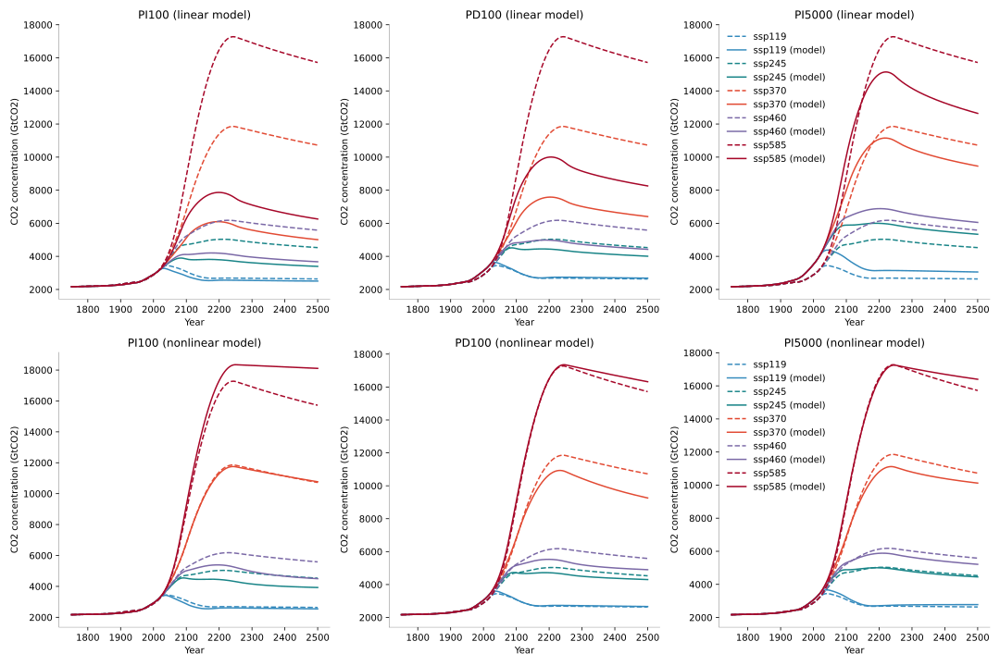

メタンと亜酸化窒素については線形モデルを用いる：
```
python calibrate_gas_cycle.py
```
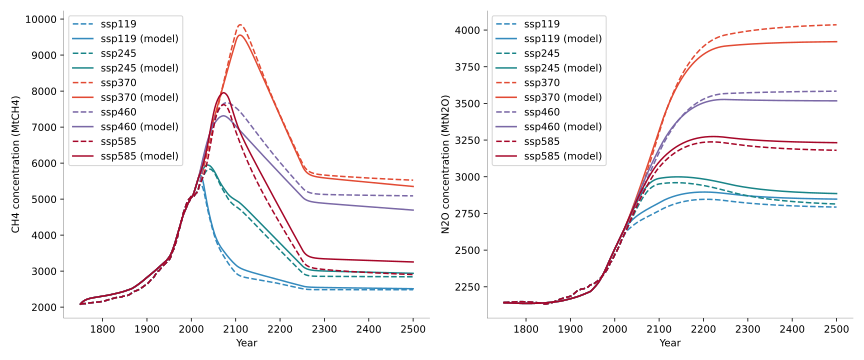

## 放射強制力

二酸化炭素，メタン，亜酸化窒素の放射強制力モデルをカリブレーション：
```
python calibrate_forcing.py
```
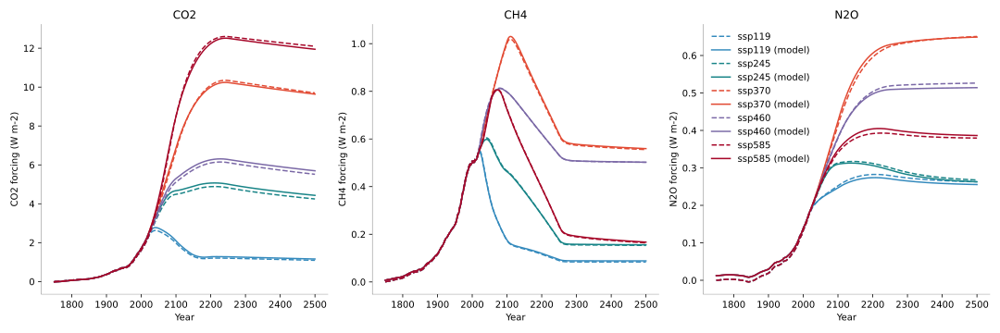

## RFF将来予測

[RFF社会経済予測](https://zenodo.org/records/6016583)をダウンロードし，
`pop_income`と`emissions`を`data_raw/RFF`に置く．

GDPと人口について，
過去データと将来予測を結合したcsvファイルをサンプルごとに作成．
```
python process_gdp_pop_data.py
```

排出量についても，
同様に過去データと将来予測を結合したcsvファイルをサンプルごとに作成．
```
python process_emission_data.py
```

作成したデータをプロット．
```
python plot_rff_projections.py
```
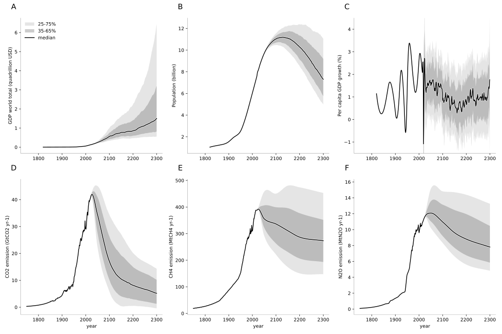

## 貯蓄率

[World Bank](https://data.worldbank.org/indicator/NY.GNS.ICTR.ZS)から貯蓄率データをダウンロードし，
`data_raw/gross_savings.csv`として保存．

```
python calibrate_savings_rate.py
```


## 選好パラメタ

[Michael Bauerの個人サイト](https://www.michaeldbauer.com/)から
[Bauer and Rudebusch (2023, REStat)](https://doi.org/10.1162/rest_a_01109)のレプリケーションコードをダウンロードし，
利子率モデルのパラメタを推定する（`estimate_uc.R`）．
結果を`data_processed/uc_estimates_y10.RData`として保存．

利子率の将来予測：

```
Rscript simulate_interest_rate.r
```
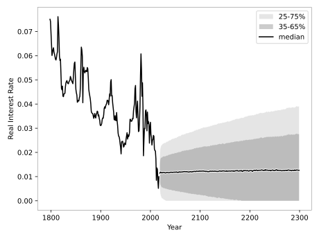


GDP成長率の将来予測と突き合わせて選好パラメタを推定：
```
python calibrate_rho_eta.py
```
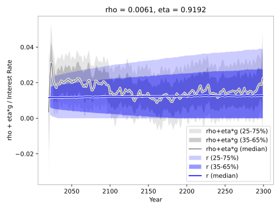

## 損害関数

[Barrage and Nordhaus (2024)](https://doi.org/10.1073/pnas.2312030121)のAppendixから
気候変動の損害推定の離散データを`data_raw/Barrage2024/dice2023.csv`として保存．

```
python calibrate_damage_function.py
```
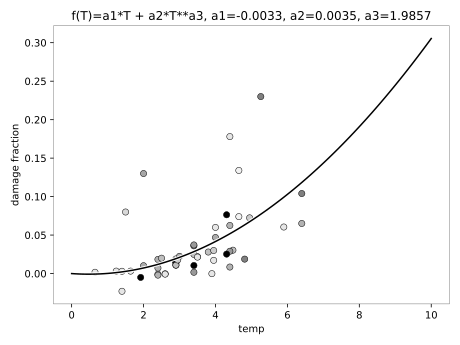


## 大気中濃度と強制力の将来予測

RFFの排出予測と物質循環モデルとを組み合わせて
大気中濃度と強制力の将来予測を作成する．

```
python calculate_scc_1_emis_conc_forc.py
```
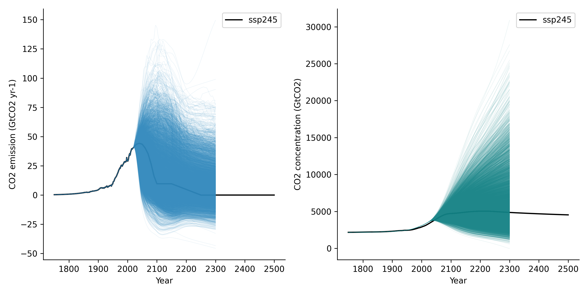

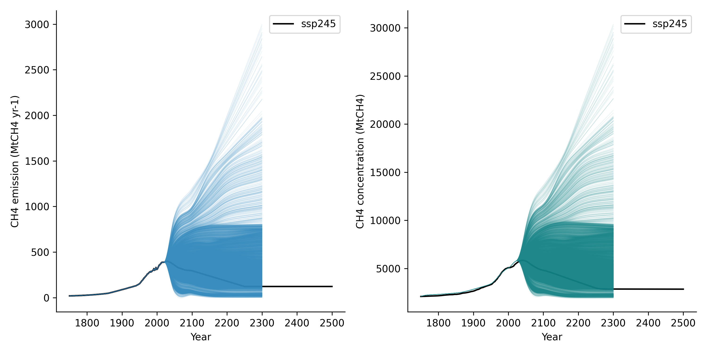

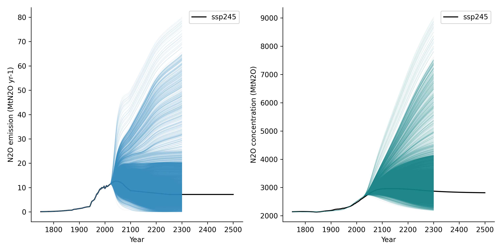


## データソース

- Barrage, L., & Nordhaus, W. (2024). Policies, projections, and the social cost of carbon: Results from the DICE-2023 model. Proceedings of the National Academy of Sciences of the United States of America, 121(13), e2312030121. https://doi.org/10.1073/pnas.2312030121
- Bauer, M. D., & Rudebusch, G. D. (2023). The rising cost of climate change: Evidence from the bond market. The Review of Economics and Statistics, 105(5), 1255–1270. https://doi.org/10.1162/rest_a_01109
- Joos, F., Roth, R., Fuglestvedt, J. S., Peters, G. P., Enting, I. G., Bloh, W. von, Brovkin, V., Burke, E. J., Eby, M., Edwards, N. R., & Others. (2013). Carbon dioxide and climate impulse response functions for the computation of greenhouse gas metrics: a multi-model analysis. Atmospheric Chemistry and Physics, 13(5), 2793–2825. https://acp.copernicus.org/articles/13/2793/2013/
- Meinshausen, M., Nicholls, Z. R. J., Lewis, J., Gidden, M. J., Vogel, E., Freund, M., Beyerle, U., Gessner, C., Nauels, A., Bauer, N., Canadell, J. G., Daniel, J. S., John, A., Krummel, P. B., Luderer, G., Meinshausen, N., Montzka, S. A., Rayner, P. J., Reimann, S., Smith, S. J., van den Berg, M., Velders, G. J. M., Vollmer, M. K., and Wang, R. H. J. (2020). The shared socio-economic pathway (SSP) greenhouse gas concentrations and their extensions to 2500, Geoscientific Model Development, 13, 3571–3605, https://doi.org/10.5194/gmd-13-3571-2020
- MPD version 2023: Bolt, Jutta and Jan Luiten van Zanden (2024). Maddison style estimates of the evolution of the world economy: A new 2023 update, Journal of Economic Surveys, 1–41. http://doi.org/10.1111/joes.12618
- [Noto Font](https://fonts.google.com/noto) is licensed under the SIL Open Font License, Version 1.1. Copyright 2012 Google Inc. All Rights Reserved. This license is available at: http://scripts.sil.org/OFL
- Osborn, T.J., Jones, P.D., Lister, D.H., Morice, C.P., Simpson, I.R., Winn, J.P., Hogan, E., and Harris, I.C., (2021). Land surface air temperature variations across the globe updated to 2019: the CRUTEM5 dataset. Journal of Geophysical Research: Atmospheres. 126, e2019JD032352, https://doi.org/10.1029/2019JD032352
- Kevin Rennert, Brian C. Prest, William A. Pizer, Richard G. Newell, David Anthoff, Cora Kingdon, Lisa Rennels, Roger Cooke, Adrian E. Raftery, Hana Ševčíková, & Frank Errickson. (2022). Resources for the Future Socioeconomic Projections (RFF-SPs) (Version 5) [Data set]. Zenodo. https://doi.org/10.5281/zenodo.6016583
- Smith, Christopher J. (2019, October 21). Effective Radiative Forcing from Shared Socioeconomic Pathways (Version v0.3.1). Zenodo. http://doi.org/10.5281/zenodo.3515339
- Tatebe, Hiroaki; Watanabe, Masahiro (2018). MIROC MIROC6 model output prepared for CMIP6 CMIP.Earth System Grid Federation. https://doi.org/10.22033/ESGF/CMIP6.881
- World Bank. Gross savings (% of GDP), World Development Indicators, The World Bank Group, https://data.worldbank.org/indicator/NY.GNS.ICTR.ZS
- Zebedee Nicholls, & Jared Lewis. (2021). Reduced Complexity Model Intercomparison Project (RCMIP) protocol (v5.1.0) [Data set]. Zenodo. https://doi.org/10.5281/zenodo.4589756
